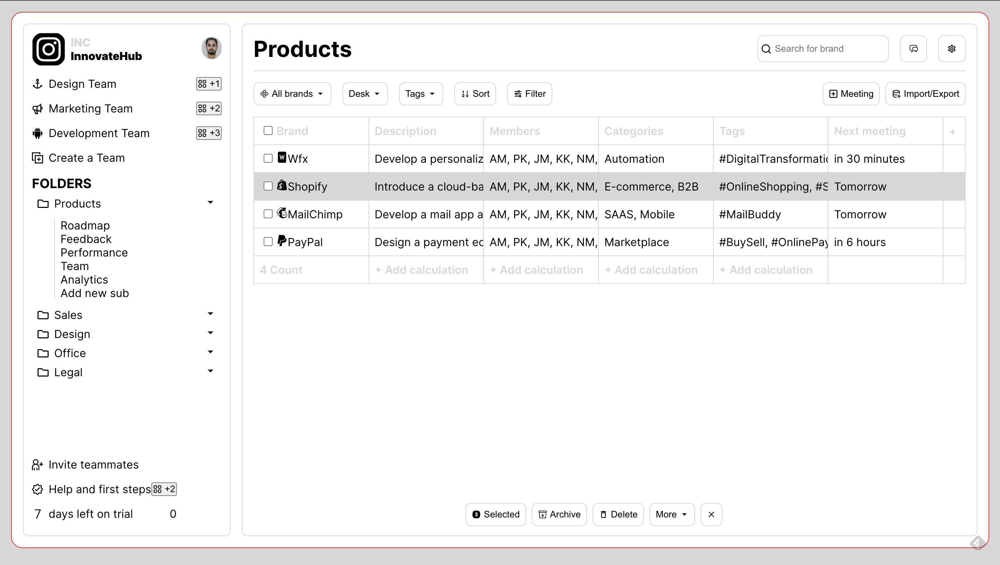

# Project Management App

Welcome to the Project Management App, a sophisticated tool developed with ReactJS and Vite for effective project organization. This README provides an overview of the app's features and how to get started.

## Deployed Link

https://project-management-app-vert.vercel.app/

## Source Code Link

https://github.com/Ankush-nitjsr/project-management-app

## Table of Contents

- [Prerequisites](#prerequisites)
- [Installation](#installation)
- [Usage](#usage)
  - [Team and Folder Navigation](#team-and-folder-navigation)
  - [Main Component](#main-component)
    - [Search](#search)
    - [Filter](#filter)
    - [Table](#table)
  - [Footer Bar](#footer-bar)
- [Tech Stack](#tech-stack)



## Prerequisites

Before you begin, ensure you have the following installed:

- [Node.js](https://nodejs.org/)
- [npm](https://www.npmjs.com/) (Node.js package manager)

## Installation

1. Clone the repository:

   ```bash
   git clone https://github.com/your-username/project-management-app.git
   cd project-management-app

   ```

2. Install dependencies:

   ```bash
   npm install

   ```

3. Run the app:
   ```bash
   npm run dev
   ```

# Usage

## Team and Folder Navigation

The app displays different team names (e.g., Design team, Marketing team, Product team) and folders (e.g., Products, Sales, Design, Office, Legal) in the aside component. Click on a team or folder to navigate to its details.

## Main Component

The main component consists of a powerful set of features to manage and organize projects efficiently.

### Search

Use the search function to quickly find projects based on their brand name.

### Filter

Filter projects based on all brands, desks, tags, and use the sort and filter button for advanced options.

### Table

The table displays project details, including brand name, description, members involved, categories, tags, and the next meeting timeline.

## Footer Bar

The footer bar provides options for selected projects, including Archive, Delete, More, and Close.

# Tech Stack

The project is built using the following technologies and React features:

- React
- Vite
- React Context API
- useState
- useEffect

Feel free to explore and customize the Project Management App to suit your project organization needs. Happy managing!
